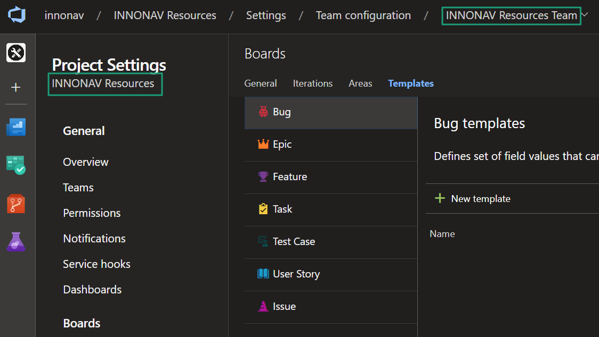

# INNONAV - Create child work item

## Create child work item
Providing 3 actions (buttons) to create a child work i tem with template based on the item type

## Info

The template for the workitem should be defined in the "INNONAV Resources" and the team name must be "INNONAV Resources Team".

## Release notes

* v0.1.1
  * init

## Contributors

HED
DME

